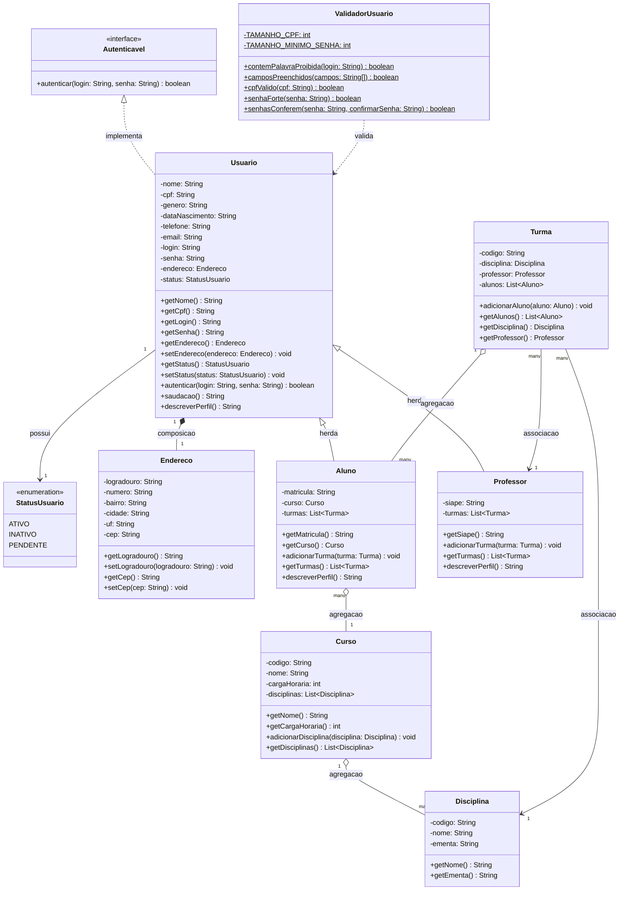

# Diagrama de Classes — SUAP IFBA (Atividade 11)

Este diagrama parte do que já existe no projeto (`Usuario`, `Autenticavel`,
`ValidadorUsuario`) e evolui o domínio para um cenário de **SUAP do IFBA**,
cobrindo as quatro tasks do desafio da Atividade 11:

- **Task 02 — objeto como atributo:** `Usuario` guarda um `Endereco` (composição, atributo privado com getter/setter).
- **Task 03 — um para muitos:** `Turma` guarda uma `List<Aluno>` e `Aluno`/`Professor` guardam uma `List<Turma>`; a lista nunca é exposta diretamente, apenas via método `adicionar...` e um getter que devolve cópia.
- **Task 04 — enum:** `StatusUsuario` é um enum com valores fixos (`ATIVO`, `INATIVO`, `PENDENTE`), usado como tipo do atributo `status` em `Usuario`.
- **Task 01 — relações com cardinalidade explícita:** herança, associação, agregação e composição estão todas representadas abaixo, com as pontas indicando a cardinalidade.

## Diagrama

## Justificativa das relações

| Relação | Tipo | Por quê |
|---|---|---|
| `Autenticavel` ⟶ `Usuario` | Realização (`<\|..`) | `Usuario` implementa o contrato da interface, já existente no código. |
| `Usuario` ⟶ `Aluno` / `Professor` | Herança (`<\|--`) | `Aluno` e `Professor` são especializações de `Usuario` — compartilham nome, cpf, login, senha, endereço, status, mas cada um tem atributos próprios (`matricula`/`curso` vs `siape`). `Usuario` continua concreta (não abstrata) porque `TelaLogin`/`TelaCadastroUsuario` ainda instanciam um `Usuario` "genérico" diretamente. |
| `Usuario` *-- `Endereco` | **Composição** (`*--`) | O endereço não tem sentido nem ciclo de vida fora de um usuário específico — se o `Usuario` é destruído, o `Endereco` também é. Atributo privado, exposto só por getter/setter (Task 02). |
| `Usuario` --> `StatusUsuario` | Associação (`-->`) | `Usuario` usa o enum como tipo de um atributo, mas o enum não é "parte" do usuário no sentido de composição — é um valor compartilhado e fixo (Task 04). |
| `Aluno` o-- `Curso` | **Agregação** (`o--`) | Um `Curso` existe independentemente dos alunos matriculados nele (continua existindo mesmo sem alunos); vários alunos podem "pertencer" ao mesmo curso. |
| `Curso` o-- `Disciplina` | Agregação | Disciplinas existem de forma mais ou menos independente da instância do curso (podem ser compartilhadas entre cursos/matrizes), então o vínculo é de todo-parte fraco, não composição. |
| `Turma` o-- `Aluno` | **Agregação, 1..N via List** | Uma `Turma` mantém a lista de alunos matriculados, mas o `Aluno` sobrevive fora da turma. Segue a Task 03: `adicionarAluno(Aluno)` é o único jeito de inserir, e `getAlunos()` deve devolver uma cópia/lista imutável — nunca a referência interna. |
| `Turma` --> `Professor` / `Turma` --> `Disciplina` | Associação | A turma referencia um professor responsável e uma disciplina, mas não "possui" nenhum dos dois — ambos existem de forma totalmente independente da turma. |
| `ValidadorUsuario` ⇢ `Usuario` | Dependência (`..>`) | `ValidadorUsuario` só usa `Usuario`/seus dados como parâmetro de método (`String`s), sem manter referência como atributo — é uma dependência de uso, não uma associação estrutural. |

## Observação sobre a Task 03 (não deixar a lista exposta)

O diagrama mostra `getAlunos(): List<Aluno>`, mas a assinatura por si só não garante
encapsulamento — a implementação em `Turma` deve devolver uma cópia (ex.:
`new ArrayList<>(alunos)`) ou `Collections.unmodifiableList(alunos)`, nunca
`return alunos;` diretamente, senão quem chama o getter consegue `add`/`remove`
por fora da classe.

## Atualização — Atividade 12 (Herança)

`Usuario` ganhou dois métodos novos para deixar o polimorfismo explícito e testável:

- **`saudacao(): String`** — **herdado sem alteração** por `Aluno` e `Professor`. Nenhuma das duas subclasses sobrescreve este método; as duas usam exatamente a implementação da classe mãe.
- **`descreverPerfil(): String`** — **sobrescrito com `@Override`** em `Aluno` (devolve matrícula + curso) e em `Professor` (devolve SIAPE + quantidade de turmas). Mesmo método chamado, resultado diferente por tipo — polimorfismo em ação.

A justificativa completa de por que essa hierarquia é herança (e não composição) está em `atividade12-task01-justificativa-pr.md`, pronta para colar na descrição do Pull Request.
